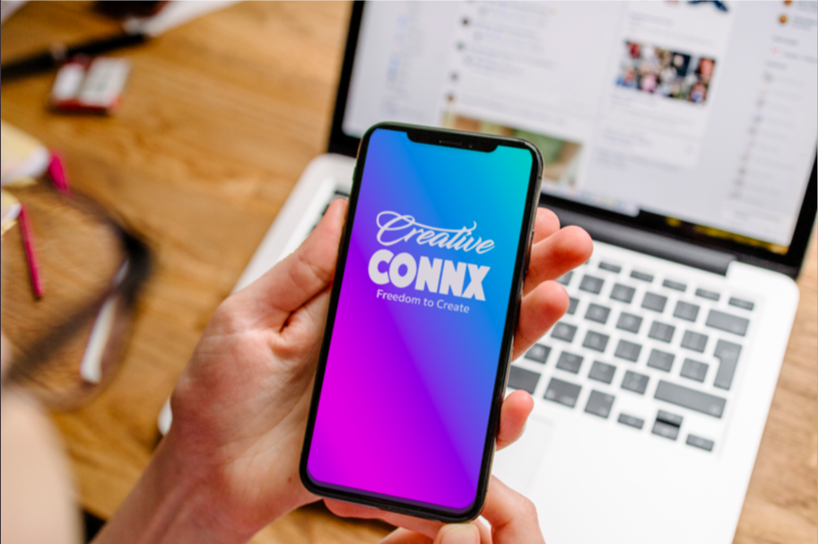

# Creative Freedom

## Creative Freedom Co is an online community that’s helps creatives achieve success. The movement and site was founded upon the ideal that individuals can find greater success through collaboration.

## Weblink: https://creative-freedom.herokuapp.com/

## Trello link: https://trello.com/b/xXVVM6mE/cfc-app

## Technologies Used:
Languages - HTML5, CSS3, Javascript, Python React

Design - Animista.net

Software - Visual Studio, PyCharm,  and Google, Google and more Google.